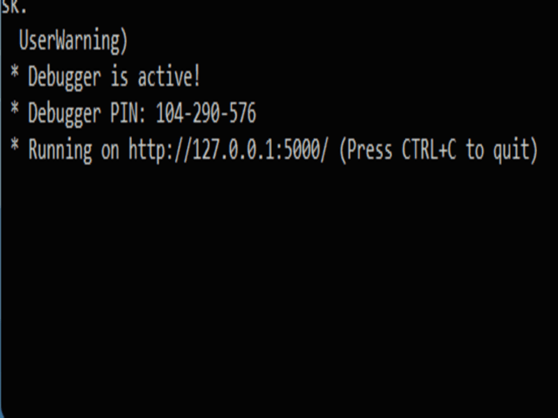

<!-- Improved compatibility of back to top link: See: https://github.com/othneildrew/Best-README-Template/pull/73 -->
<a name="readme-top"></a>
<!--
*** Thanks for checking out the Best-README-Template. If you have a suggestion
*** that would make this better, please fork the repo and create a pull request
*** or simply open an issue with the tag "enhancement".
*** Don't forget to give the project a star!
*** Thanks again! Now go create something AMAZING! :D
-->


<!-- PROJECT SHIELDS -->
<!--
*** I'm using markdown "reference style" links for readability.
*** Reference links are enclosed in brackets [ ] instead of parentheses ( ).
*** See the bottom of this document for the declaration of the reference variables
*** for contributors-url, forks-url, etc. This is an optional, concise syntax you may use.
*** https://www.markdownguide.org/basic-syntax/#reference-style-links
-->
[![Contributors][contributors-shield]][contributors-url]
[![Forks][forks-shield]][forks-url]
[![Stargazers][stars-shield]][stars-url]
[![Issues][issues-shield]][issues-url]
[![MIT License][license-shield]][license-url]
[![LinkedIn][linkedin-shield]][linkedin-url]


<!-- PROJECT LOGO -->
<br />
<div align="center">
  <a href="https://github.com/Akhil-Dev-P-B/SMS-Spam-Detection">
    
  </a>

<h3 align="center">SMS Spam filtering using NLP</h3>

  <p align="center">
    A Sms spam filtering Flask app created with the help of python and jupyter notebook
    <br />
  </p>
</div>


<!-- TABLE OF CONTENTS -->
<details>
  <summary>Table of Contents</summary>
  <ol>
    <li>
      <a href="#about-the-project">About The Project</a>
      <ul>
        <li><a href="#built-with">Built With</a></li>
      </ul>
    </li>
    <li>
      <a href="#getting-started">Getting Started</a>
      <ul>
        <li><a href="#prerequisites">Prerequisites</a></li>
        <li><a href="#installation">Installation</a></li>
      </ul>
    </li>
    <li><a href="#license">License</a></li>
    <li><a href="#contact">Contact</a></li>
    <li><a href="#acknowledgments">Acknowledgments</a></li>
  </ol>
</details>


<!-- ABOUT THE PROJECT -->
## About The Project


This is a repo for my MCA mini project `SMS spam detection using NLP`, which is a NLP model used to detect whether a message is spam or not. It is created with the help of jupyter notebook and implemented with flask.

<p align="right">(<a href="#readme-top">back to top</a>)</p>


### Built With

* [![Anaconda][Anaconda.js]][Anaconda-url]
* [![Python][Python.js]][Python-url]
* [![Flask][Flask.js]][Flask-url]
* [![Jupyter][Jupyter.io]][Jupyter-url]

<p align="right">(<a href="#readme-top">back to top</a>)</p>


<!-- GETTING STARTED -->
## Getting Started

This is an example of how you may give instructions on setting up your project locally.
To get a local copy up and running follow these simple example steps.

### Prerequisites

This is an example of how to list things you need to use the software and how to install them.

First you need to install python with flask on your device. On Windows, you can install anaconda since we can also install python and flask with its installer. On unix systems such as Ubuntu or Mac, use the terminal to install components.

* example
  ```sh
  sudo apt-get install python
  ```

Search for help on Internet if you are not sure how to do it by yourself.

### Installation

1. Clone the repo
   ```sh
   git clone https://github.com/Akhil-Dev-P-B/SMS-Spam-Detection.git
   ```
2. Open terminal in location `[file location]/Flask/` (Use Anaconda terminal if you're using anaconda).
  
   You can use `cd` command to navigate to project folder 
   ```sh
   cd [folder location]/Flask
   ```
3. Run the app.py file
   ```js
   python app.py
   ```
4. Now you will get a `ip address` as given below. Copy the address.

   
   
5. Paste the `ip address` in the address bar of any browser and run.

<p align="right">(<a href="#readme-top">back to top</a>)</p>


<!-- LICENSE -->
## License

Distributed under the GPL 3.0 License. See `LICENSE.txt` for more information.

<p align="right">(<a href="#readme-top">back to top</a>)</p>


<!-- CONTACT -->
## Contact

Akhil Dev P.B - [AkhilDev LinkedIn](https://www.linkedin.com/in/akhildevpb/) - akhildev1089@gmail.com

Project Link: [https://github.com/Akhil-Dev-P-B/SMS-Spam-Detection](https://github.com/Akhil-Dev-P-B/SMS-Spam-Detection)

<p align="right">(<a href="#readme-top">back to top</a>)</p>


<!-- ACKNOWLEDGMENTS -->
## Acknowledgments

* This project was a part of internship with [`SmartInternz`](https://smartinternz.com/) program, powered by IBM.
* The models was trained locally and also on IBM Watson studio.
* This project was a part of my Post Gradudate program in Union Christian College, Aluva.

<p align="right">(<a href="#readme-top">back to top</a>)</p>


<!-- MARKDOWN LINKS & IMAGES -->
<!-- https://www.markdownguide.org/basic-syntax/#reference-style-links -->
[contributors-shield]: https://img.shields.io/github/contributors/Akhil-Dev-P-B/SMS-Spam-Detection.svg?style=for-the-badge
[contributors-url]:https://github.com/Akhil-Dev-P-B/SMS-Spam-Detection/graphs/contributors
[forks-shield]: https://img.shields.io/github/forks/Akhil-Dev-P-B/SMS-Spam-Detection.svg?style=for-the-badge
[forks-url]: https://github.com/Akhil-Dev-P-B/SMS-Spam-Detection/network/members
[stars-shield]: https://img.shields.io/github/stars/Akhil-Dev-P-B/SMS-Spam-Detection.svg?style=for-the-badge
[stars-url]: https://github.com/Akhil-Dev-P-B/SMS-Spam-Detection/stargazers
[issues-shield]: https://img.shields.io/github/issues/Akhil-Dev-P-B/SMS-Spam-Detection.svg?style=for-the-badge
[issues-url]: https://github.com/Akhil-Dev-P-B/SMS-Spam-Detection/issues
[license-shield]: https://img.shields.io/github/license/Akhil-Dev-P-B/SMS-Spam-Detection.svg?style=for-the-badge
[license-url]: https://github.com/Akhil-Dev-P-B/SMS-Spam-Detection/blob/master/LICENSE.txt
[linkedin-shield]: https://img.shields.io/badge/-LinkedIn-black.svg?style=for-the-badge&logo=linkedin&colorB=555
[linkedin-url]: https://linkedin.com/in/akhildevpb


[Anaconda.js]: https://img.shields.io/badge/Anaconda-90ee90?style=for-the-badge&logo=Anaconda&logoColor=Green
[Anaconda-url]: https://www.anaconda.com/
[Python.js]: https://img.shields.io/badge/Python-ffff00?style=for-the-badge&logo=Python&logoColor=61DAFB
[Python-url]: https://www.python.org/
[Flask.js]: https://img.shields.io/badge/Flask-000000?style=for-the-badge&logo=Flask&logoColor=61DAFB
[Flask-url]: https://flask.palletsprojects.com/en/2.2.x/
[Jupyter.io]: https://img.shields.io/badge/Jupyter-4f4f4f?style=for-the-badge&logo=jupyter&logoColor=ffa500
[Jupyter-url]: https://jupyter.org/
